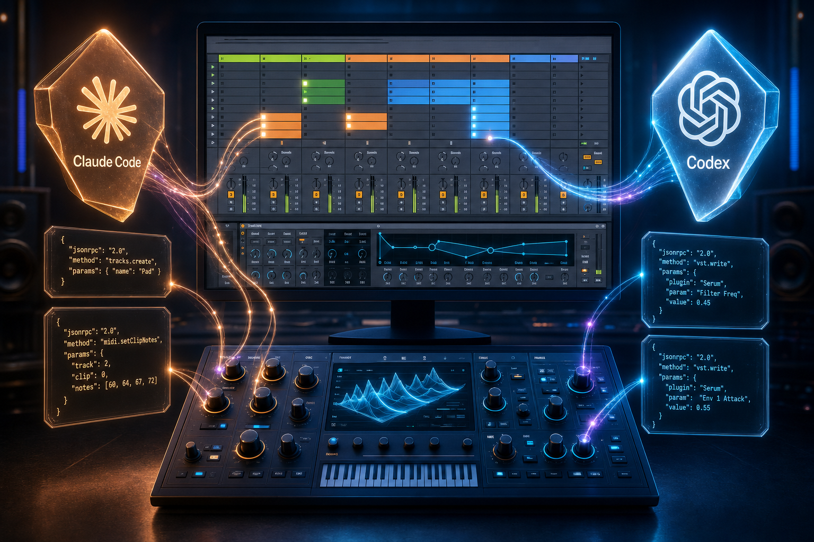

# Soniq



> **An AI-native music production interface for Ableton Live 12.**
> Soniq turns your DAW into a workbench a coding agent can actually use — composing arrangements, generating MIDI, designing sounds, and steering plugins at the granularity of every track, every clip, every knob.

## The thesis

DAWs were built for humans pointing at knobs.

LLMs can now write code, edit prose, design UIs, talk to APIs — but they can't *make music with you* because there's no clean interface between an agent and a working session. Existing MIDI-out tools turn the agent into a glorified step sequencer; existing automation hooks expose at best a handful of pre-mapped parameters.

Soniq is that interface, designed AI-first.

Tell Claude *"build me a deep house intro: a four-on-the-floor kick on track 1, a moody pad on track 2 with Serum, eight bars, slow attack"* — and it should be able to do it. End to end. Inside Live. As tool calls.

## What the agent can do

| Pillar | What the agent does | Status |
|---|---|---|
| 🎨 **Sound design** | Read & write the **full** parameter space of any VST. Serum 2's 2,623 params are all reachable; the agent designs sounds by issuing JSON-RPC batches like "set 16 knobs at once for a dark cinematic pad". | ✅ working today |
| 🎚️ **Track / session control** | Create, name, arm, mute tracks; load devices; query session state; route audio. | 🟡 Plan 2 |
| 🎼 **MIDI generation** | Write notes into clips, build arpeggios, chord progressions, generative sequences; play test tones. | 🟡 Plan 2 |
| 💾 **Preset & wavetable management** | Save/load presets across plugins, swap wavetables, browse libraries — operations the agent chains while composing. | 🟡 Plan 2 |

**Human-in-the-loop, on purpose.** Today's LLMs can't *listen* to a render and tell a warm pad from a brittle one — that's still a human job. Soniq is built around that: the user listens, says "too bright, more sub, slower attack", and the agent translates that into precise parameter changes. The agent contributes the *vocabulary of the synth* (which knobs, what ranges, sensible defaults); the user contributes the *ear*. Audio-feedback for the agent itself is intentionally out of scope until multimodal models can usefully judge timbre.

## Why this works architecturally

Ableton's "Configure" mode caps any VST at 128 automated parameters — enough for a MIDI controller, way too few for a sound-design agent. Serum 2 alone has 2,623.

Soniq side-steps the cap by hosting the VST **inside the Max for Live device** (via Max's `vst~` object), then exposing every parameter through a local WebSocket → MCP server pipeline. From Claude Code's perspective, every knob is just a tool call. Same audio quality, same MIDI flow as a native track plugin, but with the full keyboard of expression unlocked.

```
  Claude Code / any MCP agent
            │ stdio (MCP)
            ▼
  ┌──────────────────────┐
  │  MCP server (TS)     │  tools: read_vst_schema, set_vst_param, ...
  └──────────┬───────────┘
             │ JSON-RPC 2.0 over WebSocket   (127.0.0.1:9123)
             ▼
  ┌──────────────────────────────────────────┐
  │  Soniq.Bridge.amxd  (Max for Live)       │
  │   ├── Node for Max  ──►  WebSocket server│
  │   ├── vst~          ──►  Serum / Vital   │
  │   └── LOM           ──►  tracks, clips   │
  └──────────────────────────────────────────┘
                       │
                       ▼
                 Ableton Live 12
```

The protocol is **VST-agnostic** by design: schema is reflected from `vst~` at runtime. Drop in Vital, Pigments, Massive X — Soniq adapts. The track/MIDI path uses Live's Object Model (LOM), the universal Live API.

## Status, in numbers

Plan 1 (foundation + Serum vertical slice) is operational on macOS / Live 12 Suite / Max 9:

- **2,623** Serum 2 parameters reachable (543 musical, after filtering 2,080 MIDI passthrough)
- **23/23** tests green (15 protocol schema + 8 device RPC)
- End-to-end demo: agent reads schema → designs a 16-parameter "warm pad" → writes batch → user plays it

## Roadmap

### ✅ Plan 1 — Foundation (shipped)

| Done | Detail |
|---|---|
| Repo + workspace | pnpm workspace, shared protocol package (zod), JSON-Schema build pipeline |
| M4L device skeleton | `Soniq.Bridge.amxd` + Max Project + launcher pattern (cross-platform stable) |
| Wire protocol | JSON-RPC 2.0 over WebSocket on `127.0.0.1:9123`, version handshake, error codes |
| Node for Max RPC server | Routing, hello handshake, graceful shutdown (EADDRINUSE retry + zombie-PID recovery) |
| `vst~` bridge | Schema reflection: 1 `params` + 1 `get -4` + N `get i` → assembled into `{index, name, min, max, default}` |
| MCP server skeleton | TypeScript, stdio entry, 3 tools (`read_vst_schema`, `read_vst_params`, `set_vst_param`) |
| MIDI passthrough filter | Strips ~2,080 `CC<N> Chan <M>` params so the agent sees synthesis knobs only |
| Bidirectional read/write | Verified live: agent designed a 16-knob "cinematic pad", user played it |
| Docs + OSS | Spec + plan committed; repo public at github.com/enkerewpo/soniq |

### 🟡 Plan 2 — Composition surface (next)

The big lift: make the agent able to compose, not just tweak.

| Capability | What it unlocks | Notes |
|---|---|---|
| `tracks.list` / `select` / `create` | "Make a new MIDI track called 'pad'" | Direct LOM via `live.path` |
| `clips.create` / `clips.setNotes` | "Write a 4-bar C-minor arpeggio in clip 1" | Push notes through the LOM clip API |
| `midi.testTone` | One-shot listen during sound design without arming a clip | Trivial via Max `noteout` |
| `vst.savePreset` / `loadPreset` | Agent saves "v1 of cinematic pad" before iterating; can A/B | Uses `vst~` `read` / `write` messages (`.fxp` files) |
| `transport.play` / `stop` / `tempo` | Agent drives playback for the listen-and-tweak loop | LOM Song API |
| Event notifications | Push `param_changed` to client when user touches a knob in Serum's UI — agent stays in sync | WS server → notifications, no `id` |
| `mcp-server` reconnect & throttle | Server-side coalescing of rapid writes within 50ms; auto-reconnect on Live restart | Already in design doc, not yet coded |

### 🔭 Plan 3+ — Stretch targets

- **Wavetable swapping** — needs preset-level loading (Serum doesn't expose wavetable file selection as a continuous param). Probably via `vst.loadPreset` once Plan 2 ships.
- **Mod matrix routing** — `Mod N Out` is a normalized parameter that maps to a destination ID; we'd need to enumerate the mapping (likely by experimentation, since Serum doesn't expose the table) and expose `vst.modRoute(src, dst, amount)`.
- **Multiple plugin slots** — currently one `vst~` per `Soniq.Bridge.amxd` instance. A "multi-rack" version would let one device drive several plugins on different tracks via inter-device routing.
- **Windows port** — code is platform-agnostic but the M4L patch and node.script behavior haven't been re-verified on Windows yet.
- **Plugin recipe library** — once preset I/O is in, ship a curated set of starting points the agent can fork from ("808 sub bass v3", "ambient drone v1") rather than designing from scratch every time.
- **`live.audio.capture`** — only meaningful once multimodal LLMs can usefully classify timbre. Until then, the human ear closes the loop (see note above).

### ⏳ Cleanup before tagging v0.1

- [ ] Finish Plan 1 Task 8 (proper `SoniqClient` reconnect logic + unit tests)
- [ ] Plan 1 Task 14 / 15 (MCP tool layer integration tests with `InMemoryTransport`)
- [ ] Manual verification checklist (`tests/manual-verify.md`) executed against Serum 1 (only Serum 2 verified so far)
- [ ] License file (currently TBD)

## Requirements

| Item | Version |
|------|---------|
| macOS | tested on Darwin / Apple Silicon (Windows once Plan 2 lands) |
| Ableton Live 12 Suite | includes Max for Live |
| Max | 9.x (bundled with M4L); Node for Max ships Node 22.x |
| Node.js | ≥ 20 (for the MCP server) |
| pnpm | ≥ 8 |
| A VST3 instrument | Serum / Serum 2 recommended; any VST3 works |

## Quickstart

```bash
git clone https://github.com/enkerewpo/soniq && cd soniq

# Install
pnpm install
cd Soniq.Bridge/code && npm install && cd ../..

# Build + generate the JSON Schema artifact that Node for Max consumes
pnpm -r build
pnpm generate-schema

# Tests (no Ableton required — uses a fake bridge)
pnpm test
cd Soniq.Bridge/code && npm test && cd ../..
```

### Loading the device into Live

1. Open Ableton Live 12.
2. In Finder, double-click `Soniq.Bridge/Soniq.Bridge.amxd` (or drag it onto a MIDI track).
3. Inside the device, click the `vst~` object and load Serum (or your VST3 of choice).
4. The Max console should print:
   ```
   [soniq] node v22.x.x darwin/arm64
   [soniq] WebSocket RPC listening on 127.0.0.1:9123
   ```

### Registering with Claude Code

```bash
claude mcp add soniq node "$(pwd)/mcp-server/dist/index.js"
```

Then ask Claude things like:

- *"What synthesizer is loaded? Show me 5 oscillator parameters."*
- *"Design a dark cinematic pad on Serum — show me your changes."*
- *"Sweep the filter cutoff up and down over 2 seconds."*

## MCP tools (current)

| Tool | Purpose |
|------|---------|
| `read_vst_schema` | Plugin name, param count, and the full schema (filtered for MIDI passthrough by default) |
| `read_vst_params` | Read current values of one or more 0-based indices |
| `set_vst_param` | Set a parameter by index (normalized 0..1) |

Plan 2 will add: `list_tracks`, `set_clip_notes`, `play_test_tone`, `save_preset`, `load_preset`, plus event notifications for `param_changed` / `schema_reloaded`.

## Wire protocol

[JSON-RPC 2.0](https://www.jsonrpc.org/specification) over WebSocket on `127.0.0.1:9123`. Direct testing without the MCP server:

```bash
npx wscat -c ws://127.0.0.1:9123
> {"jsonrpc":"2.0","id":1,"method":"soniq.hello","params":{"version":"0.1.0"}}
> {"jsonrpc":"2.0","id":2,"method":"soniq.vst.schema","params":{}}
> {"jsonrpc":"2.0","id":3,"method":"soniq.vst.write","params":{"writes":[{"index":0,"value":0.7}]}}
```

Methods so far: `soniq.hello`, `soniq.vst.schema`, `soniq.vst.read`, `soniq.vst.write`. Full method catalog is in [`shared/src/protocol.ts`](shared/src/protocol.ts).

## Repo layout

```
soniq/
├── Soniq.Bridge/                  # M4L device + Max Project
│   ├── Soniq.Bridge.amxd          # the device itself (binary)
│   ├── Soniq.Bridge.maxproj       # Max Project descriptor
│   ├── soniq.bridge.launcher.js   # node.script entry (launcher pattern, cross-platform)
│   ├── package.json               # scopes the folder to CommonJS
│   └── code/                      # Node for Max scripts
│       ├── server.js              # WebSocket JSON-RPC server
│       ├── max-vst-bridge.js      # bridge between Node and vst~
│       ├── rpc/vst.js             # vst.* RPC handlers (more to come in Plan 2)
│       ├── protocol.schema.json   # generated from shared/protocol.ts
│       └── tests/                 # node --test
├── mcp-server/                    # MCP adapter (TypeScript)
│   └── src/{index,client}.ts + tools/
├── shared/                        # protocol types (zod) — single source of truth
├── tools/generate-json-schema.ts  # TS schemas → JSON Schema for Node for Max
└── docs/superpowers/              # design specs and implementation plans
```

## Architecture notes

- **Why a launcher** — `node.script` resolves filenames through Max's file-search-path system rather than Node.js's `require()`. Subdirectory paths like `code/server.js` behave inconsistently across macOS/Windows. The launcher sits at the top level of the project — a single uniquely-named file Max can always find — and from there uses Node's standard `require()`. This is the [Cycling '74 community-recommended pattern](https://cycling74.com/forums/nodescript-with-relative-path-windows-mac).
- **Why VST inside the M4L device** — `vst~` exposes every parameter as a normalized 0..1 control, unlike Live's track-level VST hosting which caps at 128 Configured parameters.
- **Why JSON-RPC + WebSocket + MCP** — three layers with clean separation: M4L worries only about Max messages; the WS server worries only about JSON-RPC; the MCP server worries only about tool descriptions. Each is independently testable.

Full design: [`docs/superpowers/specs/2026-05-28-soniq-design.md`](docs/superpowers/specs/2026-05-28-soniq-design.md). Implementation plan: [`docs/superpowers/plans/2026-05-28-soniq-plan-1-foundation.md`](docs/superpowers/plans/2026-05-28-soniq-plan-1-foundation.md).

## Debug mode

Set `SONIQ_DEBUG=1` before launching `node.script` to enable verbose handler logging in the Max console.

## License

TBD.

## Author

[@enkerewpo](https://github.com/enkerewpo)
